# TrainAnalysis

# 🚆 Indian Railways Train Data Analysis

## 📌 Overview

This project analyzes real-world Indian Railways train timetable data to uncover patterns in train schedules, routes, and operational efficiency.

The dataset is sourced from the Government of India's Open Data Platform, making this project based on authentic and reliable railway data.

---

## 🎯 Objectives

* Perform data cleaning and preprocessing
* Analyze train schedules and timings
* Identify patterns in train routes and delays
* Visualize key insights using graphs
* Build a predictive model using Linear Regression

---

## 🗂️ Dataset Information

* **Source:** data.gov.in (Government of India Open Data Portal)
* **Dataset Name:** Indian Railways Time Table
* **File:** `cleaned_train.csv`

### 📊 Dataset Contains:

* Train Number & Train Name
* Source and Destination Stations
* Arrival Time & Departure Time
* Distance Covered
* Route Information

---

## 🛠️ Technologies Used

* Python
* Pandas
* NumPy
* Matplotlib
* Seaborn
* Scikit-learn

---

## 🔄 Project Workflow

1. Data Collection
2. Data Cleaning
3. Exploratory Data Analysis (EDA)
4. Data Visualization
5. Model Building (Linear Regression)
6. Performance Evaluation

---

## 📁 Project Structure

```

TrainAnalysis/
│
├── project.py
├── cleaned_train.csv
├── ProjectReport.pdf
├── README.md
│
├── images/
│ ├── train_no_distribution.png
│ ├── seq_distribution.png
│ ├── distance_distribution.png
│ ├── train_vs_seq.png
│ ├── seq_vs_distance.png
│ ├── box_train.png
│ ├── box_seq.png
│ ├── box_distance.png
│ ├── heatmap.png
│ ├── pairplot.png
│ ├── regression.png

```

---

## 📊 Key Features

* Cleaned and structured railway dataset
* Visualized train patterns using charts
* Correlation analysis using heatmaps
* Built predictive model using Linear Regression

---

## 📸 Output Screenshots

---

## 📊 Data Distribution

<p align="center">
  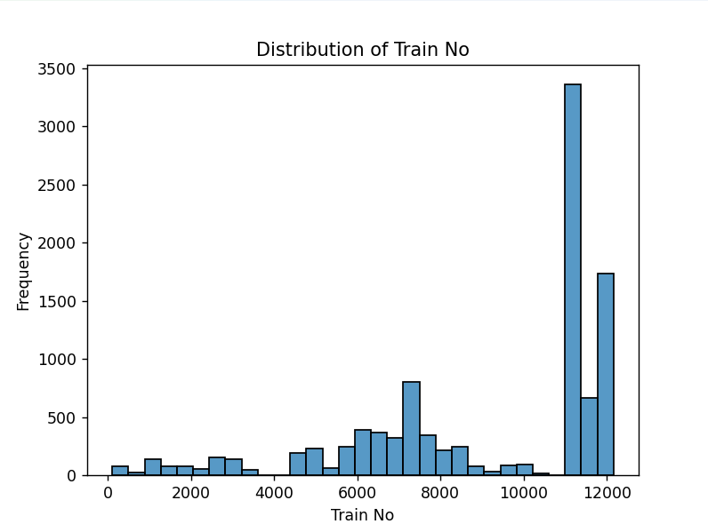
  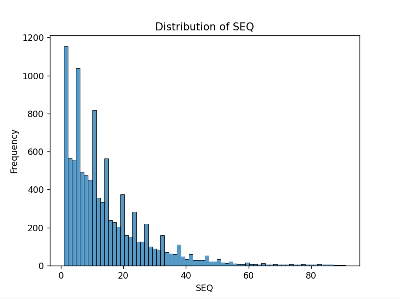
</p>

<p align="center">
  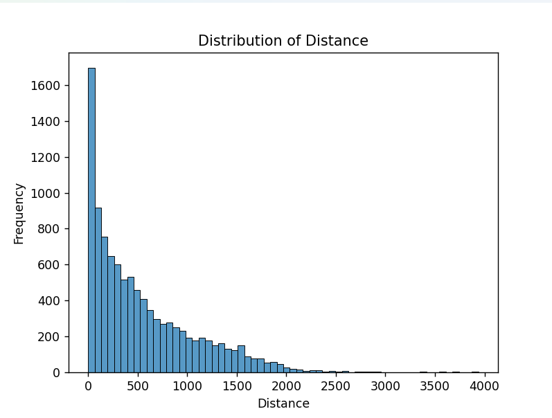
</p>

---

## 🔗 Relationships

<p align="center">
  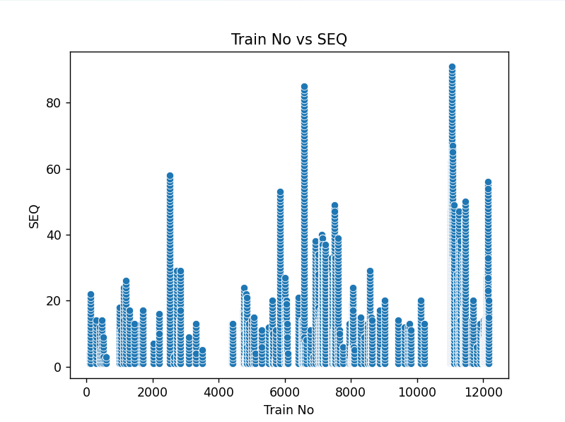
  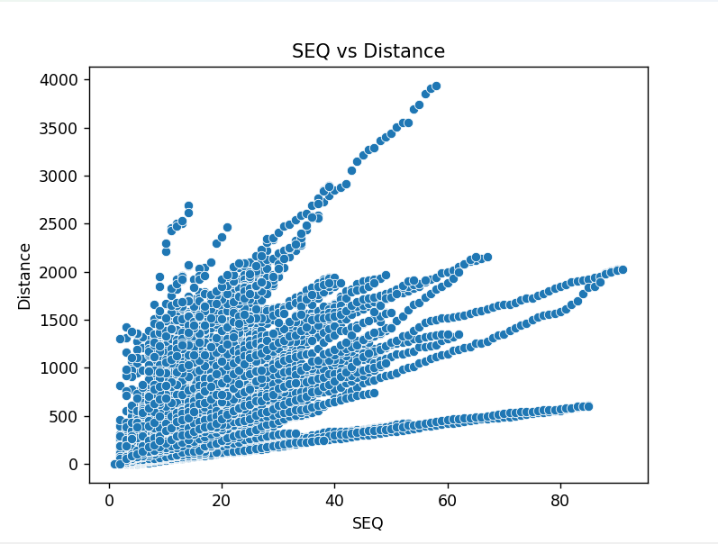
</p>

---

## 📦 Box Plot Analysis

<p align="center">
  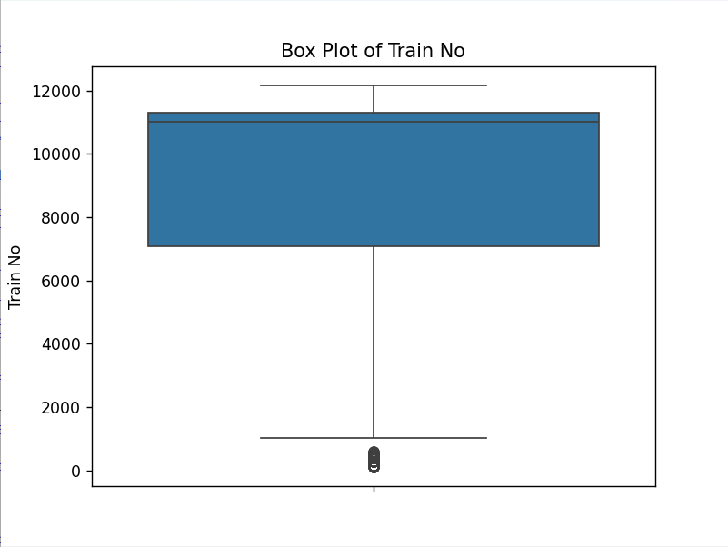
  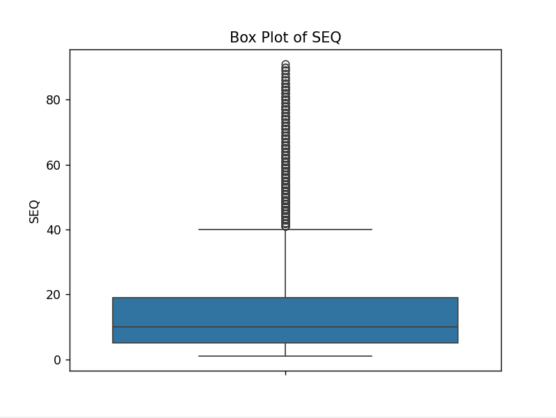
  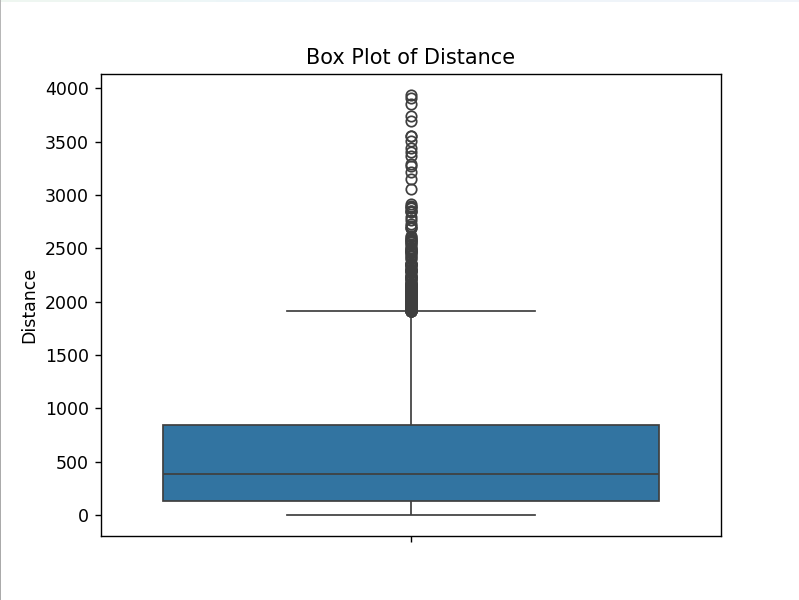
</p>

---

## 🔥 Correlation Analysis

<p align="center">
  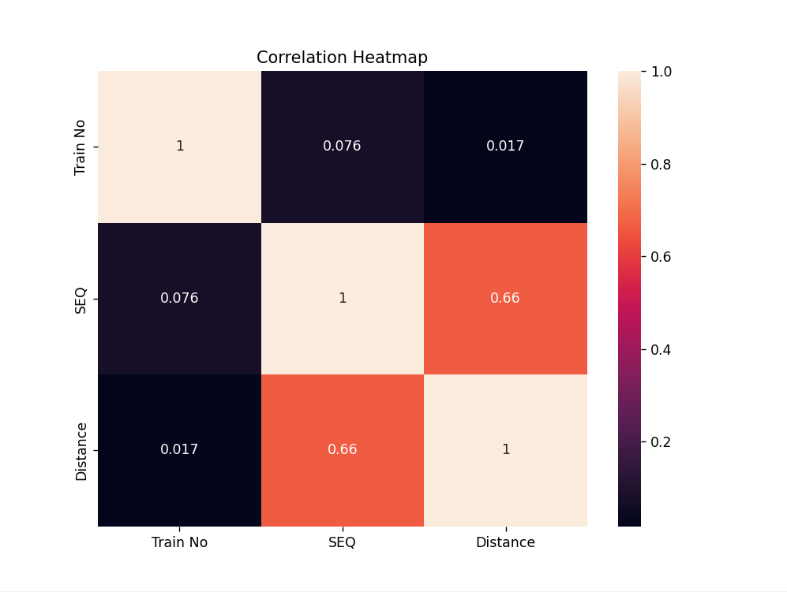
</p>

---

## 📊 Pairplot Visualization

<p align="center">
  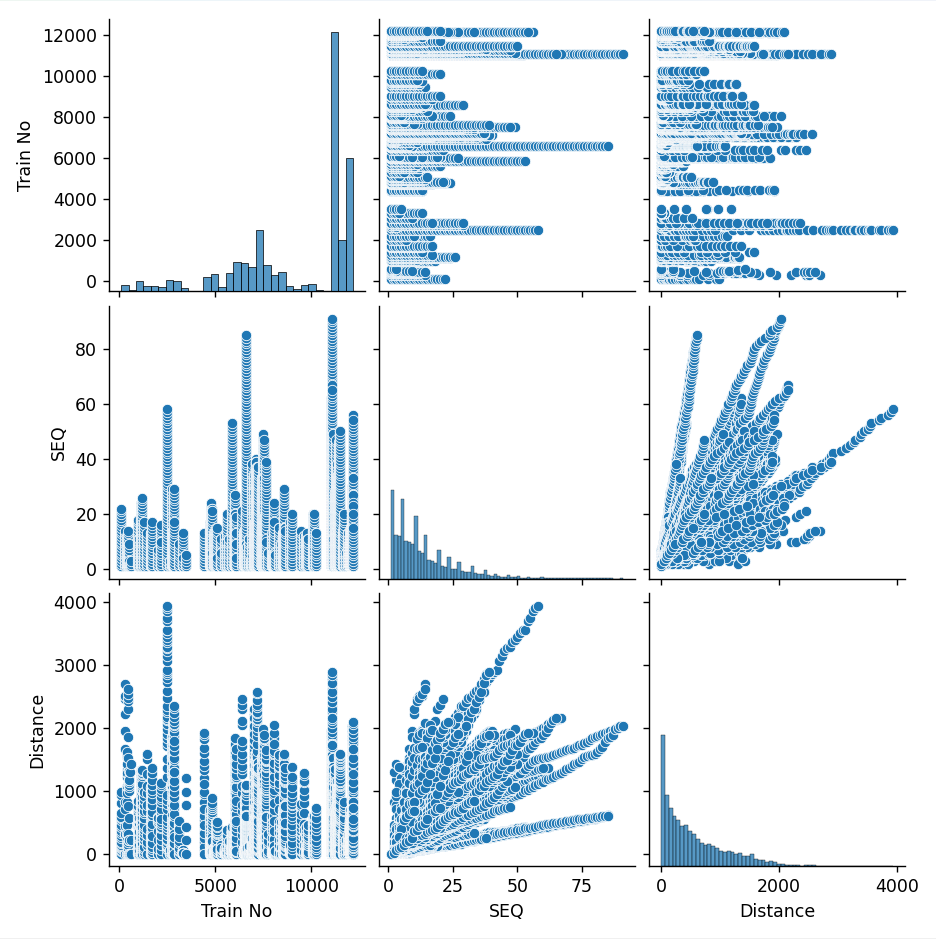
</p>

---

## 📉 Linear Regression Model

<p align="center">
  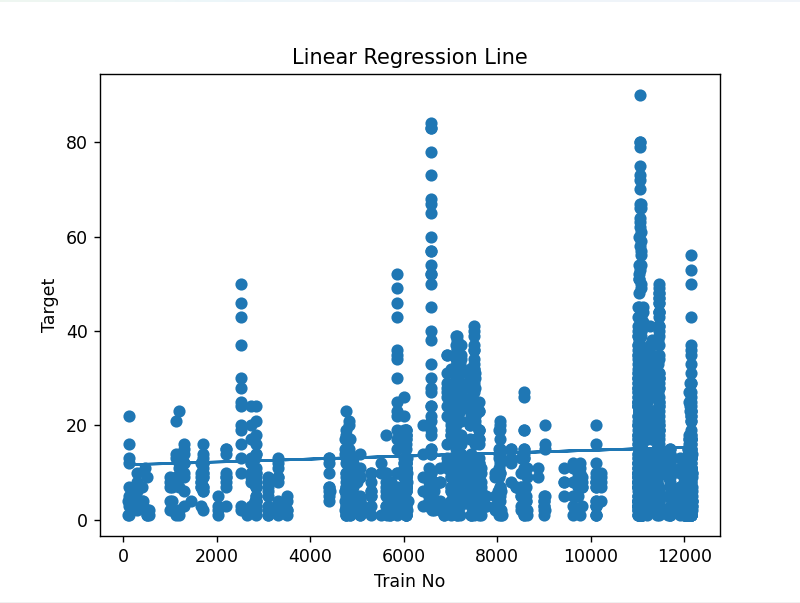
</p>

---


## ▶️ How to Run the Project

### Step 1: Install dependencies

pip install pandas numpy matplotlib seaborn scikit-learn

### Step 2: Run the project

python main.py

---

## 📌 Results & Insights

* Identified patterns in train schedules
* Analyzed relationships between variables
* Built a regression model for prediction

---

## 🔗 LinkedIn Post

https://www.linkedin.com/posts/hari-vignesh-pericharla-342576404_datascience-pythonprojects-eda-ugcPost-7451667062202028032-Rt4d

---

## 👨‍💻 Author

Hari Vignesh
B.Tech CSE Student

